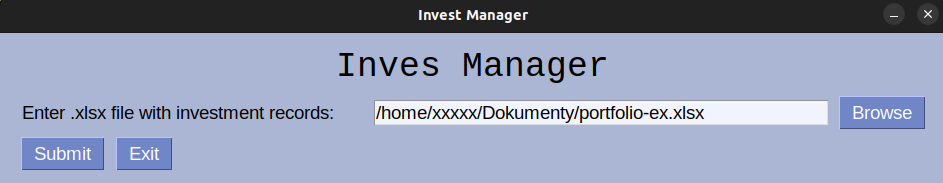
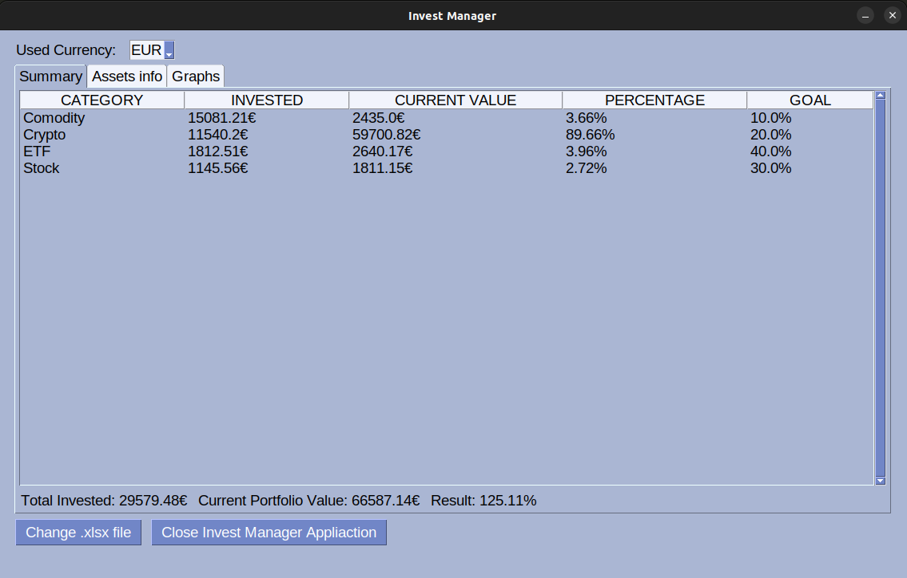
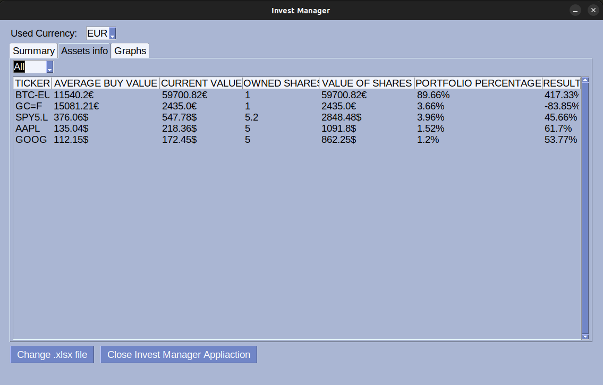
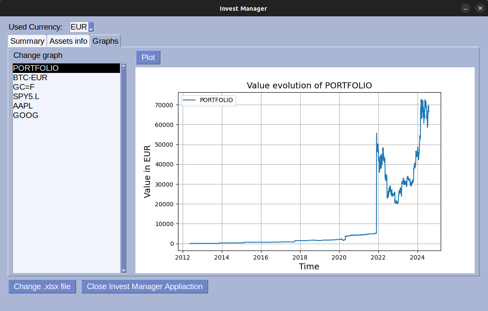

# Invest-Manager

This project is a simple Python application for financial portfolio management. The primary goal of the application is to compute the financial results of a portfolio using online stock exchange data and currency exchange rates.

A crucial component of the application is an MS Excel workbook template. This template functions as both a database for purchase records and a tool for calculating some aspects of the overall portfolio through built-in formulas. The Python application is primarily responsible for retrieving online stock exchange data and currency exchange rates.

## Requirments

+ Python 3.10+
+ tkinter (because of PySimpleGUI)
+ [openpyxl](https://pypi.org/project/openpyxl/) 3.1.5+
+ [PySimpleGUI](https://www.pysimplegui.com/) 5.0.6+
+ [CurrencyConverter](https://pypi.org/project/CurrencyConverter/) 0.17.28+
+ [yfinance](https://pypi.org/project/yfinance/) 0.2.41+
+ [matplotlib](https://pypi.org/project/matplotlib/) 3.7.1+
+ [PyInstaller](https://pyinstaller.org/en/stable/) 5.11.0+ (if you want to create a standalone executable)

## How it works

The application utilizes financial records from an MS Excel file to provide an overview of the entire portfolio. **Setting the values and tickers correctly in the Excel workbook is essential.** Here's a step-by-step breakdown of how the application works:

### 1. Initial Setup:


<div align="center">
    
</div>

+ Upon launch, a small window appears prompting you to enter the path to the Excel workbook. After you confirm the path, the application downloads currency conversion data from the European Central Bank (ECB) website and historical market closing data from the stock exchange. It does not work with real-time data; instead, it uses the latest available market closing data.


### 2. Summary page:

<div align="center">
    
</div>

+ The application then switches to the main window, displaying a summary of the portfolio by category. Categories are set in the Excel workbook, and each asset must have an assigned category.

+ For consistency, the data in this table is converted to a single currency (either EUR or USD), which can be set in the upper left corner of the application. The calculations use the latest available exchange rates.

+ The table includes details such as the amount of invested funds, their current value, the percentage of the portfolio they represent, and the set goals.


### 3. Asset Information Page:

<div align="center">
    
</div>

+ This page provides a list of assets in the portfolio that have not been sold, along with summary information about them. This includes the average purchase price, current price per share, number of shares owned, the value of these shares in the portfolio, the percentage of the portfolio each asset constitutes, and whether the investment is profitable.

+ These values are presented in their natural currency (as specified in the Excel workbook) and are not converted to a single currency (EUR or USD).


### 4. Chart Page:

<div align="center">
    
</div>

+ The final page allows you to plot the development of the entire portfolio or individual assets over time. A 'Plot' button enables graph visualization in a separate window using matplotlib.

+ Note: There is a known bug due to integration with PySimpleGUI that may affect further graphing, causing the application to behave unexpectedly.

+ All graphs are also converted to a single currency (EUR or USD) for consistency.


## Usage

The application is straightforward to use and does not require any command-line arguments. However, you must ensure a folder named `ecb_data` exists in the directory with the executable file. This folder is where the application will store downloaded data for currency conversions.

```
python3 src/__main__.py
```

or using shebang:

```
./src/__main__.py 
```

## PyInstaller

There is a command for PyInstaller. Keep in mind, that the application needs in its directory path another directory called `ecb_data` where it can download data for conversion rates.

**UNIX**
```
pyinstaller --onefile --name=InvestManager --add-data=src/ecb_data:ecb_data src/__main__.py
```

**Windows**
```
pyinstaller --onefile --name=InvestManager --windowed --icon=images/piggy.ico --add-data=src/ecb_data:ecb_data src/__main__.py
```

or:

```
python -m PyInstaller --onefile --name=InvestManager --windowed --icon=images/piggy.ico --add-data=src/ecb_data:ecb_data src/__main__.py
```